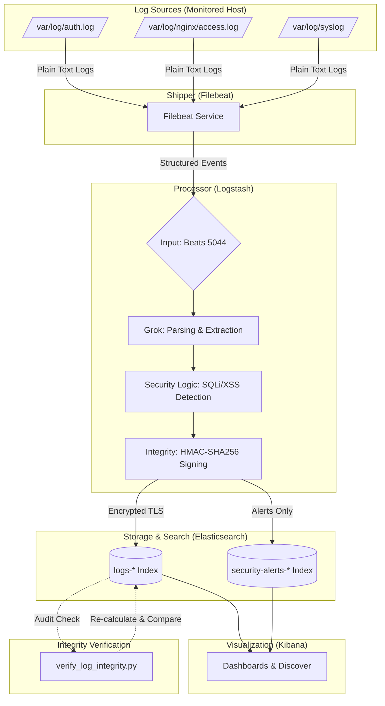

# CLM Data Pipeline Architecture

This document describes the flow of log data from collection to visualization and integrity verification.

## 1. Pipeline Overview

## 2. Detailed Data Flow

### Step 1: Collection (Filebeat)
- **Input**: Monitors specific log files on the host system.
- **Processing**: Adds metadata like `host.name`, `log_type`, and `environment`.
- **Output**: Forwards events to Logstash over the network (Beats protocol).

### Step 2: Processing & Enrichment (Logstash)
- **Parsing**: Uses **Grok** filters to turn unstructured strings (like Nginx logs) into structured fields (IP, Status Code, User-Agent).
- **Security Analysis**: Scans request URIs for malicious patterns like `UNION SELECT` or `<script>`.
- **Integrity Protection**: A Ruby filter calculates an **HMAC-SHA256** signature using a secret key. This "seals" the log entry before it is stored.
- **Normalization**: Standardizes timestamps and field names (ECS compliance).

### Step 3: Indexing & Storage (Elasticsearch)
- Data is stored in daily indices.
- **Security Alerts** are duplicated to a special index for faster incident response.
- Communication is fully encrypted via **TLS/SSL**.

### Step 4: Visualization (Kibana)
- Analysts use Kibana to query the data and view security dashboards.

### Step 5: Verification (Python Script)
- To ensure no one has tampered with the logs (even an admin with ES access), the `verify_log_integrity.py` script:
    1. Fetches a log entry from Elasticsearch.
    2. Re-calculates the HMAC using the secret key.
    3. Compares it with the stored `integrity.hmac` field.
